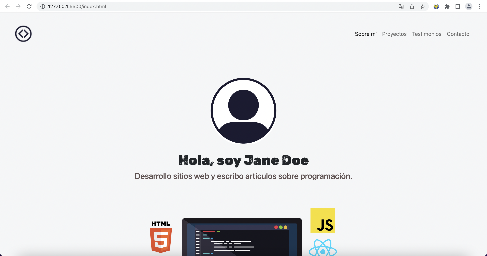
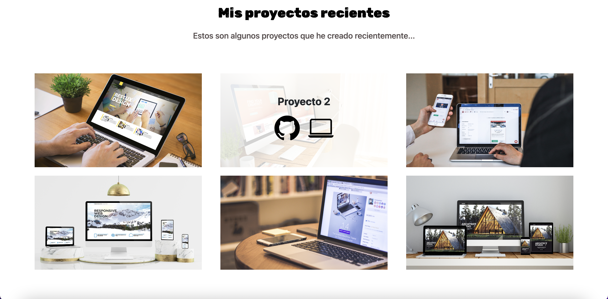
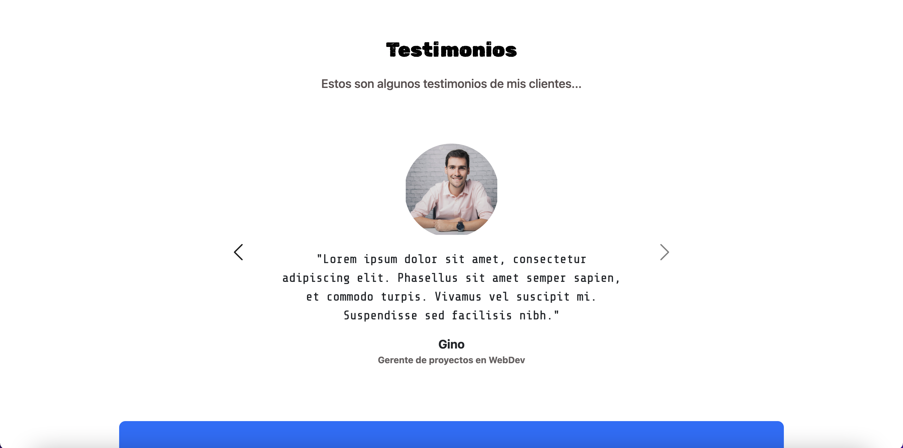

💡# Portafolio de proyectos. TECNOLOchicas Pro. (Página Responsive) 💜

Este proyecto creado para el bootcamp Tecnolochicas PRO, es una página web responsive.

El propósito de esta página web es mostrar mi portafolio de proyectos e información de contactos. Incluye una descripción breve de mis motivaciones, experiencia, proyectos y formas de contacto. 

### Capturas de pantalla:

Primera parte de la página web:

Experiencia:

Proyectos:

Testimonios:

Contacto:

## Tecnologías

Esta página web fue creada con:

* HTML
* CSS
* JavaScript 
* Bootstrap 5

Además, se incluyeron **Google Fonts** para personalizar la fuente y **Bootstrap icons** para incorporar íconos como flechas y logos de redes sociales populares. 

## Idioma

El texto de la página web está escrito en español, al igual que las clases y atributos personalizados. Las clases relacionadas con Bootstrap se incluyeron en inglés.

